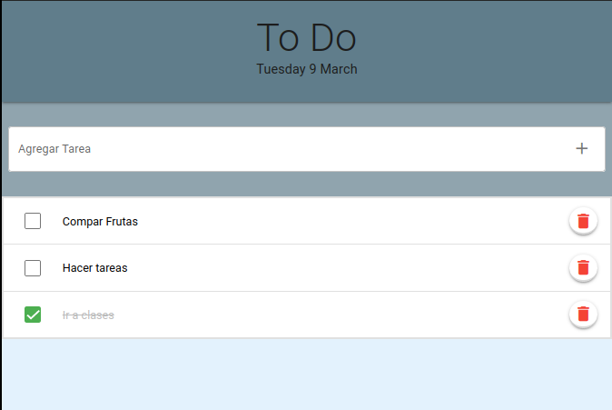

# To Do App 📋


Esta aplicación de gestión de tareas está desarrollada con Vue, utilizando Vuex y Vue Router. 

Para su interfaz gráfica se utilizó el framework Quasar y se sirve de una API Rest para obtener los datos de las tareas a realizar.

La app se encuentra hosteada en Vercel.


##Urls
[App](https://todoapp-di8ecnuof-federico-benitez.vercel.app/#/)
[Repositorio de la API](https://github.com/Federico-Benitez/Todo-App-server)

## Pasos para probar en Local
Para probar la aplicación de manera local, debe continuar con los siguentes pasos.
### Pre-requisitos 📋

```
NodeJS
```
### Clonar repositorio 
Primero debemos correr el siguiente comando en la carpeta donde queremos tener el repositorio

```
git clone https://github.com/Federico-Benitez/Todo-App.git
```

Despues de que termine de descargarse el repositorio, ya podemos abrirlo con nuestro editor de codigo.

### Instalar las dependencias 🔧
Luego de instalar todas las dependencias, ubicados en la carpeta del proyecto, corremos el siguiente comando.
```bash
npm install
```

### Inicializamos en modo desarollo
```bash
quasar dev
```

### Build para produción
En caso de querer crear una build para producción, ejecutamos el siguiente comando. 
```bash
quasar build
```
Esta build va a crearse en la carpeta en la ruta ```./dist/spa```
